# 💻 Digital Banking Frontend - Angular

Bienvenue dans le projet **Digital Banking (Frontend)**, une application web de gestion bancaire moderne développée avec **Angular**. Cette interface permet aux clients et aux administrateurs de visualiser, gérer et interagir avec leurs comptes bancaires en toute sécurité.

---

## 🗂️ Sommaire

1. [ Technologies utilisées](#-technologies-utilisées)
2. [️ Architecture du projet](#-architecture-du-projet-frontend)
3. [ Authentification & sécurité](#-authentification--sécurité)
4. [️ Lancer l’application](#️-lancer-lapplication)


---

##  Technologies utilisées

| Icône | Technologie | Rôle |
| :--: | ----------- | ---- |
|  | Angular 17+ | Framework frontend |
|  | Bootstrap | UI Design |
|  | JWT | Authentification sécurisée |
|  | TypeScript | Langage principal |
|  | SCSS / CSS | Styles |
|  | Node.js | Runtime |
|  | Angular CLI | Gestion du projet |

---

##  Architecture du projet frontend

📁 `digital-banking-frontend/`
```
  ├── accounts/ → Composants pour afficher & gérer les comptes
  ├── admin-template/ → Templates et vues spécifiques à l’administration
  ├── customers/ → Composants pour gérer les clients
  ├── customers-accounts/ → Gestion client + comptes associés
  ├── environments/ → Fichiers de configuration par environnement
  ├── guards/ → Protection des routes selon les rôles
  ├── interceptors/ → Injection automatique du JWT dans les requêtes
  ├── login/ → Page et logique de connexion utilisateur
  ├── model/ → Modèles métier : Customer, Account, etc.
  ├── navbar/ → Composant de la barre de navigation globale
  ├── new-customer/ → Composant de création de client
  ├── not-authorized/ → Affichage en cas d’accès refusé
  ├── services/ → Services pour communiquer avec l’API backend
  ├── app.component.* → Composant principal
  ├── app.module.ts → Module racine de l’application
  └── app-routing.module.ts → Configuration des routes Angular
```

---

##  Authentification & sécurité

Le frontend utilise un système de connexion JWT :

-  Stockage sécurisé du token (localStorage)
-  Intercepteur pour ajouter le JWT à chaque requête
-  Guards pour protéger les routes selon les rôles

---

## Lancer l’application

- Login page 


- Authentification en tant que admin
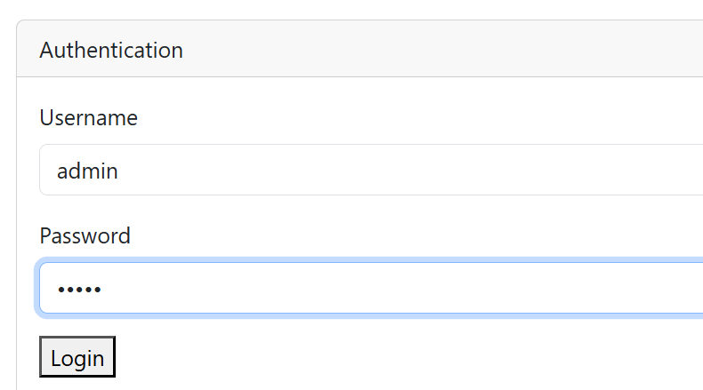

- Listes des clients
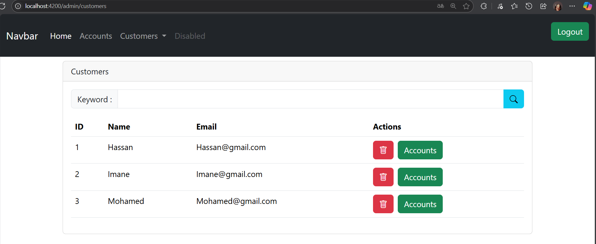

- Ajouter un nouveau client
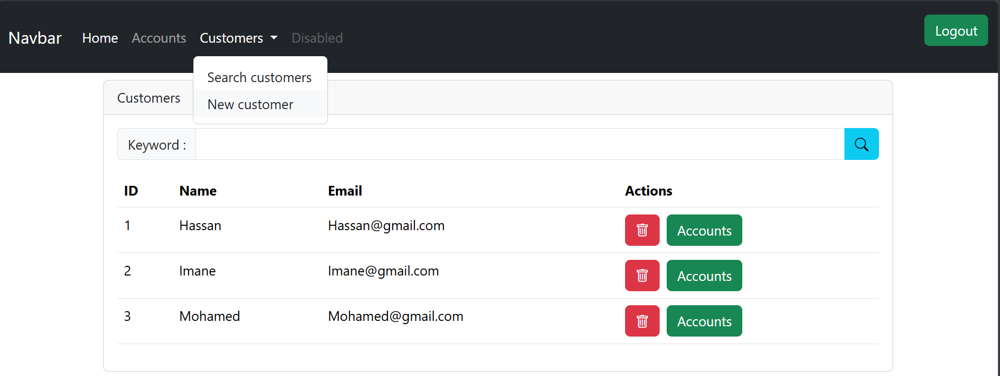

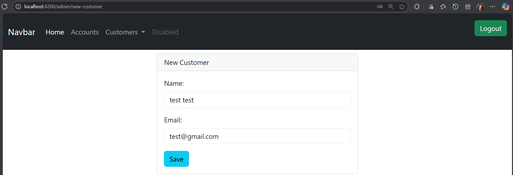

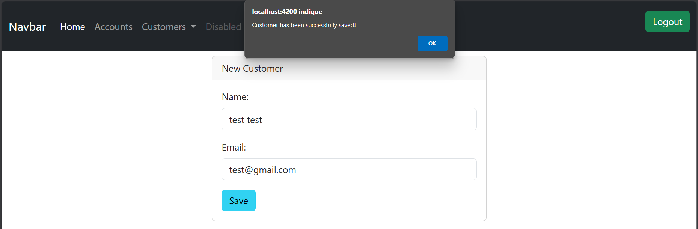

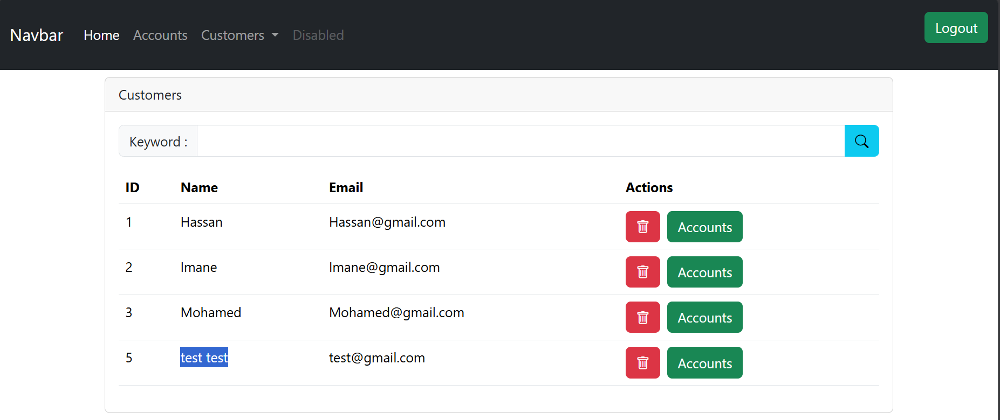

- Supprimer un client

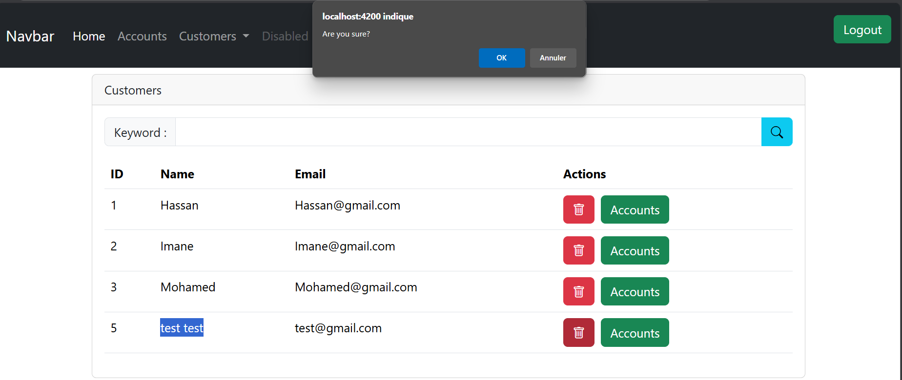

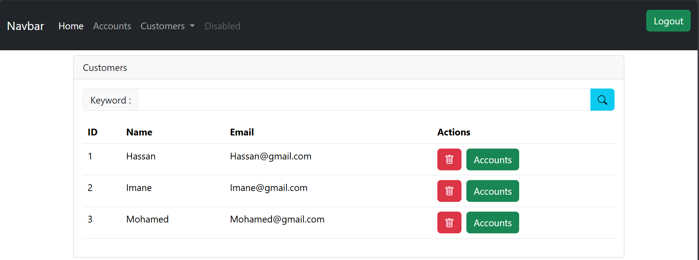

- Chercher un client


- Consulter un compte 

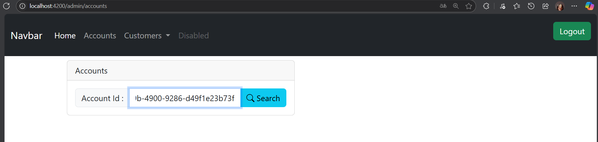

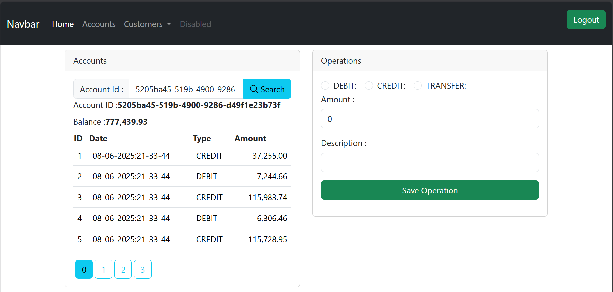

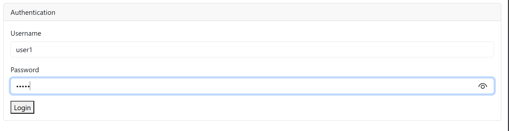
 


 Ce frontend communique avec un backend Spring Boot sécurisé. Ensemble, ils forment une solution complète de gestion bancaire digitale.

---
 Auteur : Sara EL AMRANI


